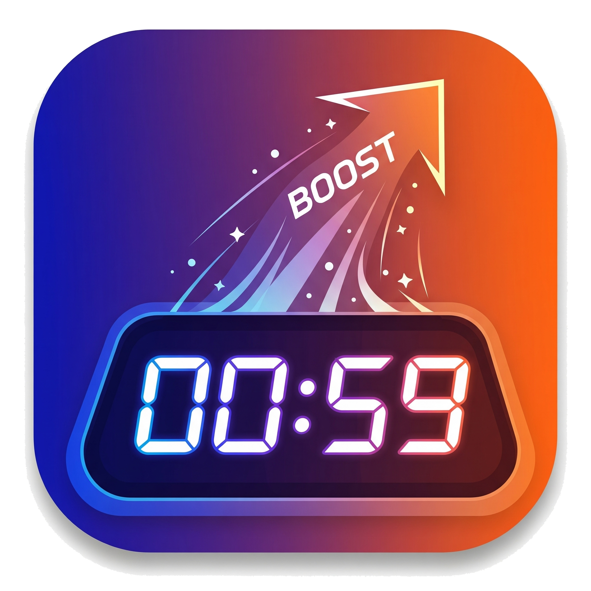

# BoostTimer



A modern, minimal desktop timer with To-Do queueing for macOS (Apple Silicon), built with Electron and vanilla HTML/CSS/JS.

## Requirements
- Node.js 18+
- macOS on Apple Silicon (M1/M2/M3)

## Install
```
npm install
```

## Development
```
npm start
```

## Build (macOS arm64)
```
npm run build:mac
```
The output `.dmg` and `.app` will be in `dist/`.

```
npm run build:linux
```
The output `.AppImage`, `.deb`, and `.snap` will be in `dist/`.

```
npm run build:win
```
The output `.exe` will be in `dist/`.

### App Icons
Place your icons in `build/` before building:
- macOS: `build/icon.icns`
- Windows: `build/icon.ico`
- Linux: `build/icon.png`

Icons are referenced in `package.json > build`.

## Features
- To-Do with estimation: add/edit/delete, drag-and-drop reorder, persistent storage
- Queue Mode: total countdown sums all to-dos and auto-advances; finished items delete automatically
- Manual Timer: set HH:MM:SS, Start/Pause/Reset
- Progress Bar: accurate progress for both queue and manual modes
- Tray (menu bar): live time title, Show/Hide, Always on Top, Quit
- Focus Mode: separate frameless, always-on-top window showing only the time
- Notifications + subtle completion sound for task and queue completion
- Modern, responsive UI with header summary (total remaining + task count)

## Code Structure
- `main.js`: Main process (window, tray, focus window, IPC, notifications)
- `preload.js`: Secure bridge (always-on-top, tray updates, focus, notify)
- `index.html`: Main UI (timer, inputs, controls, to-dos)
- `style.css`: Styling (theme, progress, to-do cards, focus overlay styles)
- `renderer.js`: Timer logic, queue mode, to-do CRUD + DnD, progress, notifications
- `focus.html`: Minimal frameless focus window UI

## Usage Tips
- Add tasks with estimation (minutes or hours). Click a task to start; or press Start to run the whole queue.
- Focus button opens a small, always-on-top time-only window.
- Close or minimize the main window to keep the app in the tray; click the tray to Show/Hide.

License: MIT
